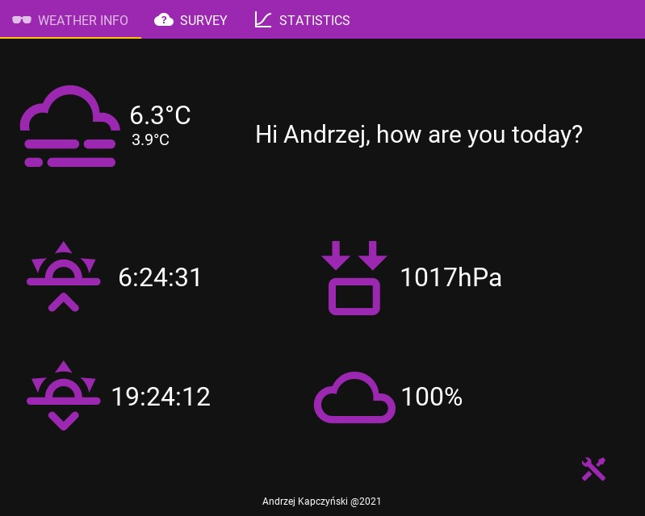
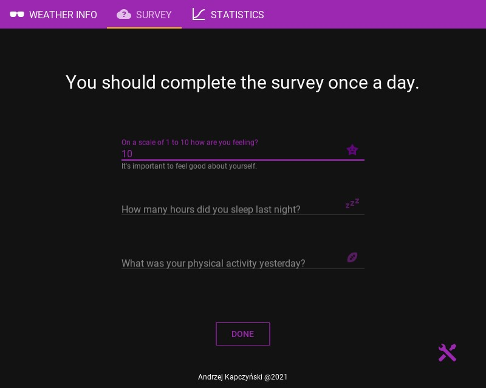
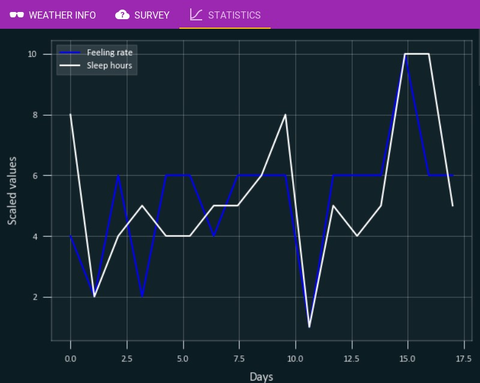
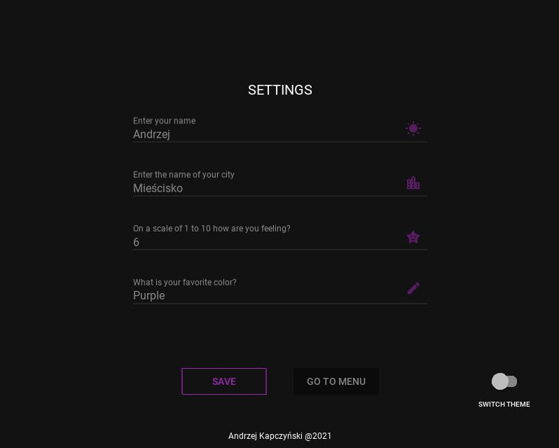
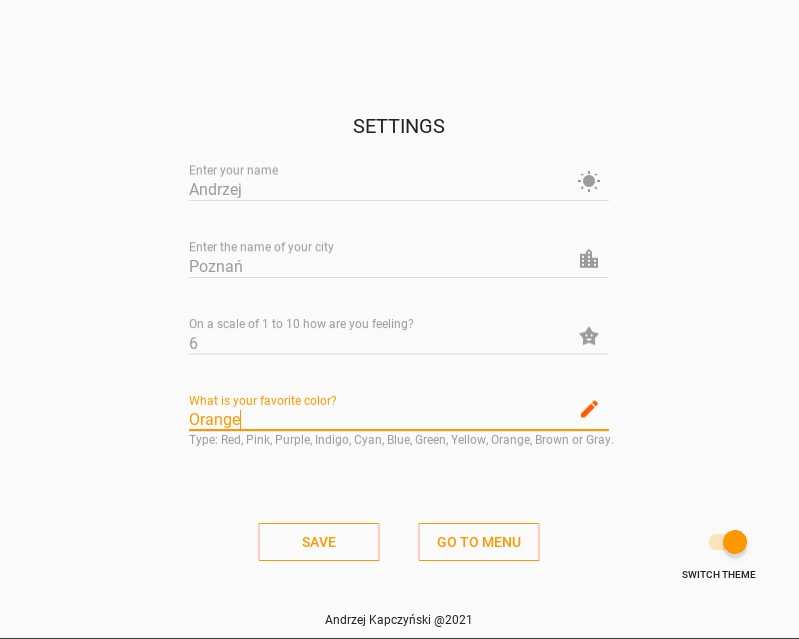

# HowAreYou
## Table of contents
* [General info](#general-info)
* [Technologies](#technologies)
* [Screenshots](#screenshots)

## General info
This project is an application that shows the weather and allows you to fill out a short survey from which the data is used to build charts. 
This allows the users to analyze their well-being in relation to various factors such as sleep, temperature etc.
	
## Technologies
Project is created with:
* Python
* Kivy
* KivyMD
* OpenWeather
* Matplotlib
	* ing-theme-matplotlib 0.1.7

## Screenshots
* **Menu**

* **Survey**

* **Statistics**

* **Settings**

* **Theme and color changing**

