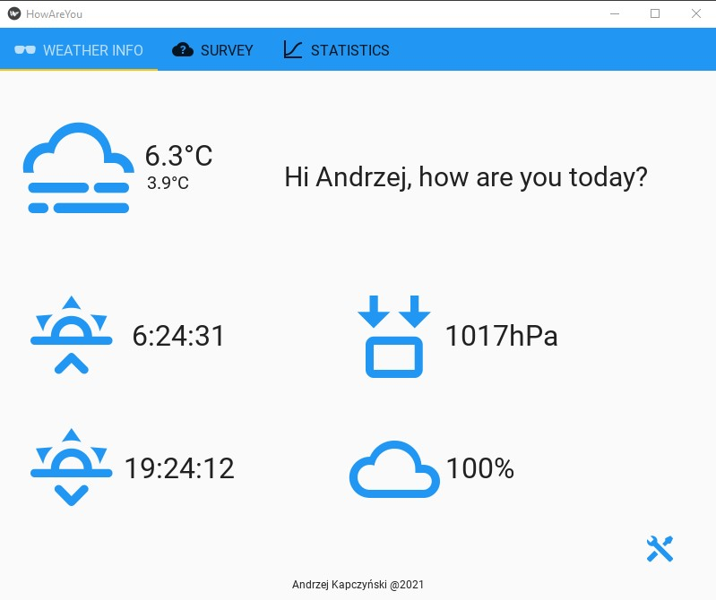
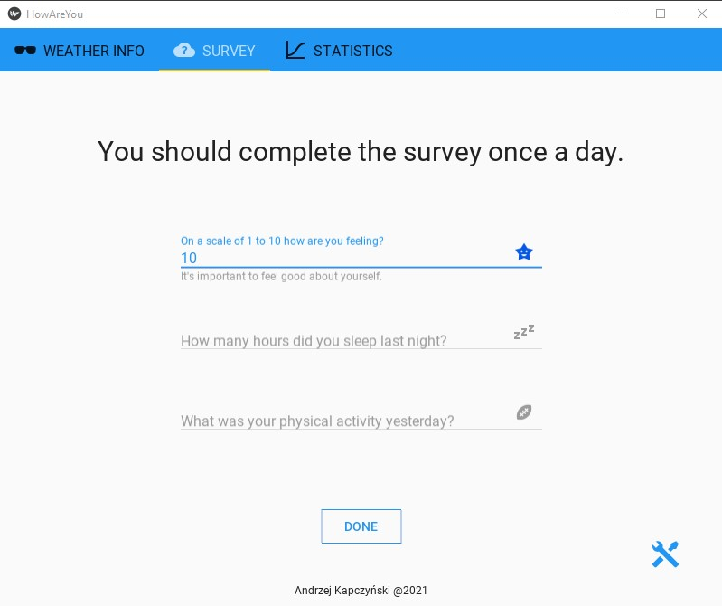
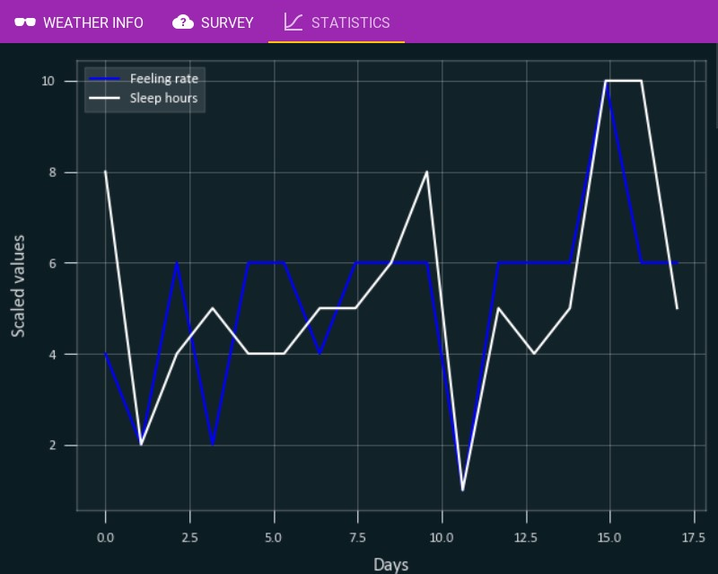
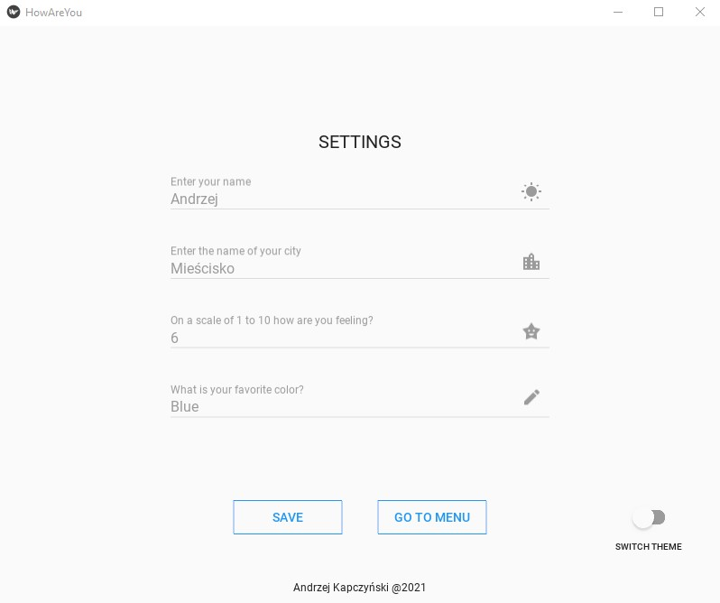
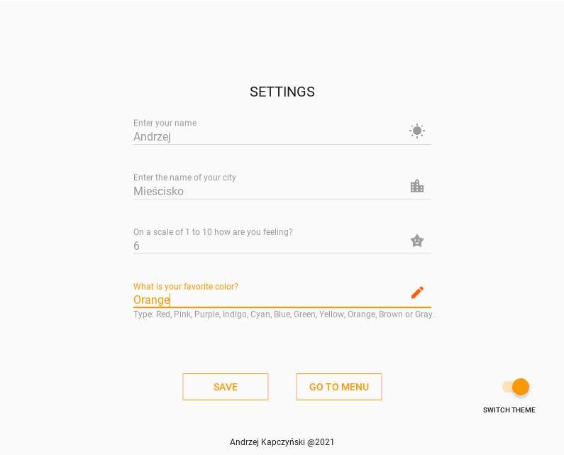

# HowAreYou
## Table of contents
* [General info](#general-info)
* [Technologies](#technologies)
* [Screenshots](#screenshots)

## General info
This project is an app that shows actual weather and ask how are you. Data is collected and then presented on the graphs.
	
## Technologies
Project is created with:
* Python
* Kivy
* Matplotlib

## Screenshots
* **Menu**

* **Survey**

* **Statistics**

* **Settings**

* **Dark theme and color changing**

